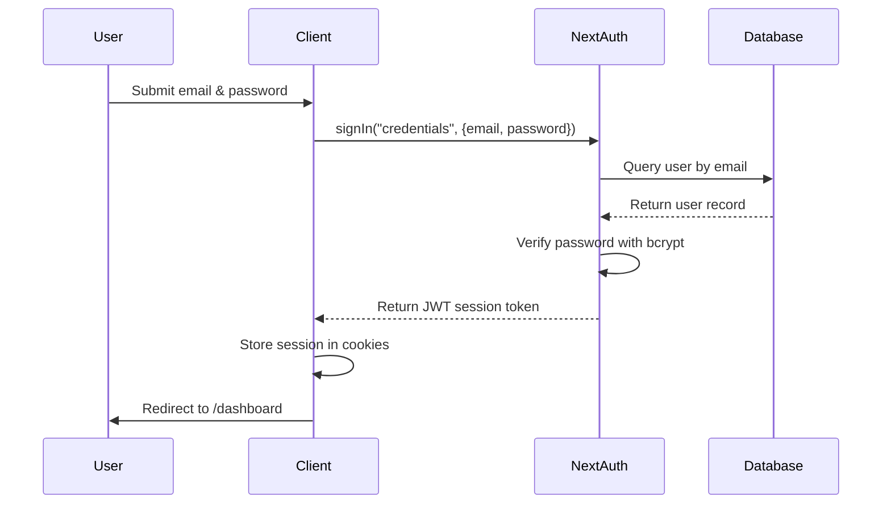

## Introduction

The GAOTEV authentication system is built on **NextAuth.js** with a credentials-based provider using JWT session strategy. It provides secure user authentication with email and password credentials, backed by Prisma ORM and bcrypt password hashing.

## Available Endpoints

NextAuth.js automatically provides the following endpoints under `/api/auth/*`:

<ParamField path="/api/auth/signin" type="POST">
  Initiates the sign-in flow. Accepts credentials and returns a session token.
</ParamField>

<ParamField path="/api/auth/signout" type="POST">
  Terminates the current session and clears the session token.
</ParamField>

<ParamField path="/api/auth/session" type="GET">
  Returns the current session information if authenticated, or null if not.
</ParamField>

<ParamField path="/api/auth/csrf" type="GET">
  Returns a CSRF token for form submissions.
</ParamField>

<ParamField path="/api/auth/providers" type="GET">
  Lists all configured authentication providers (in this case, credentials).
</ParamField>

## Authentication Flow

The authentication flow in GAOTEV follows these steps:

1. **User submits credentials** via the login form
2. **Client-side signIn** is called with email and password
3. **Server validates credentials** against the database using Prisma
4. **Password verification** is performed using bcrypt
5. **JWT token is generated** and returned to the client
6. **Session is established** and stored in cookies
7. **Protected routes** can now access session data



## Client-Side Usage

### Sign In

Use the `signIn` function from `next-auth/react` to authenticate users:

```javascript
import { signIn } from 'next-auth/react'
import { useRouter } from 'next/navigation'

const handleSubmit = async (e) => {
  e.preventDefault()
  
  const result = await signIn("credentials", {
    email,
    password,
    redirect: false,
  })

  if (result?.ok) {
    router.push("/dashboard")
  } else {
    setError("Credenciales incorrectas")
  }
}
```

<ParamField path="provider" type="string" required>
  The authentication provider to use. For GAOTEV, this is always `"credentials"`.
</ParamField>

<ParamField path="email" type="string" required>
  User's email address for authentication.
</ParamField>

<ParamField path="password" type="string" required>
  User's password for authentication.
</ParamField>

<ParamField path="redirect" type="boolean" default="true">
  Whether to redirect after sign-in. Set to `false` to handle redirection manually.
</ParamField>

### Access Session Data

Use the `useSession` hook to access current session information:

```javascript
import { useSession } from "next-auth/react"

export default function Dashboard() {
  const { data: session, status } = useSession()

  if (status === "loading") {
    return <p>Verificando sesión...</p>
  }

  if (status === "unauthenticated") {
    router.replace("/")
    return null
  }

  return (
    <div>
      <p>Bienvenido {session.user?.email}</p>
    </div>
  )
}
```

<ResponseField name="session" type="object | null">
  The current session object, or null if not authenticated.
  
  <Expandable title="Session object properties">
    <ResponseField name="user" type="object">
      User information returned from the authorize function.
      
      <ResponseField name="id" type="string">
        User's unique identifier from the database.
      </ResponseField>
      
      <ResponseField name="email" type="string">
        User's email address.
      </ResponseField>
    </ResponseField>
    
    <ResponseField name="expires" type="string">
      ISO 8601 timestamp indicating when the session expires.
    </ResponseField>
  </Expandable>
</ResponseField>

<ResponseField name="status" type="string">
  Current authentication status. Possible values:
  - `"loading"` - Session is being fetched
  - `"authenticated"` - User is authenticated
  - `"unauthenticated"` - User is not authenticated
</ResponseField>

### Sign Out

Use the `signOut` function to terminate the user's session:

```javascript
import { signOut } from "next-auth/react"

<button onClick={() => signOut({ callbackUrl: "/" })}>
  Cerrar sesión
</button>
```

<ParamField path="callbackUrl" type="string">
  URL to redirect to after signing out. Defaults to the homepage.
</ParamField>

## Protected Routes

To protect routes and ensure only authenticated users can access them:

```javascript
'use client'

import { useSession } from "next-auth/react"
import { useRouter } from "next/navigation"
import { useEffect } from "react"

export default function ProtectedPage() {
  const { data: session, status } = useSession()
  const router = useRouter()

  useEffect(() => {
    if (status === "unauthenticated") {
      router.replace("/")
    }
  }, [status, router])

  if (status === "loading") {
    return <div>Loading...</div>
  }

  if (!session) return null

  // Render protected content
  return <div>Protected content</div>
}
```

## Security Considerations

### Password Hashing

All passwords are hashed using **bcrypt** before storage. The authentication handler verifies passwords securely:

```typescript
const isValid = await bcrypt.compare(
  credentials.password,
  user.password
)
```

### NEXTAUTH_SECRET

<Warning>
  The `NEXTAUTH_SECRET` environment variable is **required** for production. This secret is used to encrypt JWT tokens and should be a random string of at least 32 characters.
</Warning>

Generate a secure secret:

```bash
openssl rand -base64 32
```

Add to your `.env` file:

```bash
NEXTAUTH_SECRET=your_generated_secret_here
```

### Session Strategy

GAOTEV uses **JWT** (JSON Web Token) session strategy, which:

- Stores session data in encrypted cookies
- Doesn't require database lookups for session validation
- Is stateless and scalable
- Has configurable expiration times

### CSRF Protection

NextAuth.js includes built-in CSRF protection for all authentication endpoints. CSRF tokens are automatically validated on state-changing operations.

### Input Validation

The authorize function validates that both email and password are provided:

```typescript
if (!credentials?.email || !credentials?.password) {
  return null
}
```

## Error Handling

### Sign In Errors

When `signIn` is called with `redirect: false`, it returns a result object:

```javascript
const result = await signIn("credentials", {
  email,
  password,
  redirect: false,
})

if (result?.error) {
  // Handle authentication error
  console.error(result.error)
} else if (result?.ok) {
  // Authentication successful
  router.push("/dashboard")
}
```

### Common Error Scenarios

- **Invalid credentials**: Returns `null` from authorize function
- **Missing credentials**: Returns `null` when email or password is empty
- **Database errors**: Will throw and should be caught by error boundaries
- **User not found**: Returns `null` when email doesn't exist in database

## Next Steps

<CardGroup cols={2}>
  <Card title="NextAuth Configuration" icon="gear" href="/api/auth/nextauth">
    Detailed NextAuth.js configuration reference
  </Card>
  
  <Card title="Database Schema" icon="database" href="/api/database/schema">
    User model and Prisma schema documentation
  </Card>
</CardGroup>
