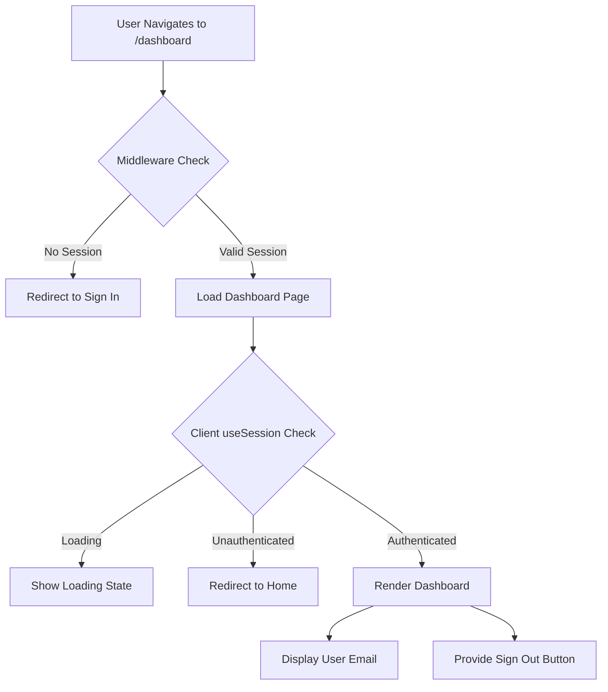

## Overview

The GAOTEV dashboard is a **protected route** that requires authentication. It uses NextAuth.js session management to verify user access and provides a personalized welcome screen with sign-out functionality.

<Info>
The dashboard automatically redirects unauthenticated users to the home page.
</Info>

## Protected Route Implementation

The dashboard is implemented as a client component at `app/dashboard/page.jsx`:

```jsx app/dashboard/page.jsx
'use client'

import { useSession, signOut } from "next-auth/react"
import { useRouter } from "next/navigation"
import { useEffect } from "react"

export default function Dashboard() {
  const { data: session, status } = useSession()
  const router = useRouter()

  useEffect(() => {
    if (status === "unauthenticated") {
      router.replace("/")
    }
  }, [status, router])

  if (status === "loading") {
    return (
      <div className="min-h-screen flex items-center justify-center bg-zinc-100">
        <p className="text-zinc-500">Verificando sesión...</p>
      </div>
    )
  }

  if (!session) return null

  return (
    <div className="min-h-screen bg-zinc-100 flex items-center justify-center">
      <div className="bg-white p-8 rounded-xl shadow-md w-full max-w-lg">

        <h1 className="text-2xl font-semibold text-zinc-800 mb-4">
          Dashboard
        </h1>

        <p className="text-zinc-600 mb-2">
          Bienvenido {session.user?.email}
        </p>

        <button
          onClick={() => signOut({ callbackUrl: "/" })}
          className="w-full rounded-lg bg-red-500 py-2.5 text-white font-medium hover:bg-red-600 transition"
        >
          Cerrar sesión
        </button>

      </div>
    </div>
  )
}
```

## Session Management

### useSession Hook

The dashboard uses NextAuth's `useSession` hook to access authentication state:

```jsx
const { data: session, status } = useSession()
```

<CardGroup cols={2}>
  <Card title="session" icon="user">
    Contains user data (email, id) when authenticated
  </Card>
  <Card title="status" icon="circle-dot">
    Authentication state: "loading", "authenticated", or "unauthenticated"
  </Card>
</CardGroup>

### Session States

<AccordionGroup>
  <Accordion title="loading">
    Initial state while NextAuth.js verifies the session. The dashboard displays a loading message.
  </Accordion>
  <Accordion title="authenticated">
    User has a valid session. The dashboard content is rendered with user information.
  </Accordion>
  <Accordion title="unauthenticated">
    No valid session found. User is redirected to the home page.
  </Accordion>
</AccordionGroup>

## Authentication Guard

### Client-Side Redirect

The dashboard implements a client-side authentication guard using `useEffect`:

```jsx
useEffect(() => {
  if (status === "unauthenticated") {
    router.replace("/")
  }
}, [status, router])
```

<Note>
`router.replace()` is used instead of `router.push()` to prevent users from navigating back to the dashboard using the browser's back button.
</Note>

### Loading State

While the session status is being determined, a loading screen is displayed:

```jsx
if (status === "loading") {
  return (
    <div className="min-h-screen flex items-center justify-center bg-zinc-100">
      <p className="text-zinc-500">Verificando sesión...</p>
    </div>
  )
}
```

<Tip>
Showing a loading state prevents flickering and provides better user experience during session verification.
</Tip>

### Null Guard

An additional safety check ensures the component returns null if no session exists:

```jsx
if (!session) return null
```

This prevents the dashboard UI from rendering briefly before the redirect completes.

## Middleware Protection

The dashboard route is also protected at the middleware level using NextAuth's built-in middleware:

```typescript middleware.ts
export { default } from "next-auth/middleware"

export const config = {
  matcher: ["/dashboard"],
}
```

### How Middleware Works

<Steps>
  <Step title="Request Intercepted">
    Any request to `/dashboard` is intercepted by the middleware.
  </Step>
  <Step title="Session Verified">
    NextAuth middleware checks for a valid JWT session token.
  </Step>
  <Step title="Redirect or Allow">
    If no valid session exists, the user is redirected to the sign-in page. Otherwise, the request proceeds.
  </Step>
</Steps>

<Warning>
Middleware protection runs on the server before the page loads, providing an additional security layer beyond client-side guards.
</Warning>

### Matcher Configuration

The `matcher` array specifies which routes should be protected:

```typescript
matcher: ["/dashboard"]
```

<Tip>
You can add more routes to the matcher array to protect additional pages: `matcher: ["/dashboard", "/settings", "/profile"]`
</Tip>

## Dashboard UI Components

The dashboard features a clean, centered card layout:

### Layout Structure

```jsx
<div className="min-h-screen bg-zinc-100 flex items-center justify-center">
  <div className="bg-white p-8 rounded-xl shadow-md w-full max-w-lg">
    {/* Dashboard content */}
  </div>
</div>
```

### User Information Display

The dashboard displays the authenticated user's email:

```jsx
<p className="text-zinc-600 mb-2">
  Bienvenido {session.user?.email}
</p>
```

<Info>
The optional chaining operator (`?.`) safely accesses the email even if the user object structure changes.
</Info>

## Sign Out Functionality

### SignOut Implementation

The sign-out button uses NextAuth's `signOut` function:

```jsx
<button
  onClick={() => signOut({ callbackUrl: "/" })}
  className="w-full rounded-lg bg-red-500 py-2.5 text-white font-medium hover:bg-red-600 transition"
>
  Cerrar sesión
</button>
```

### SignOut Parameters

<CardGroup cols={2}>
  <Card title="callbackUrl" icon="arrow-right">
    Redirects user to the home page after signing out
  </Card>
  <Card title="redirect (default: true)" icon="rotate">
    Automatically navigates to the callback URL
  </Card>
</CardGroup>

<Note>
The `signOut` function invalidates the JWT session token and clears the session cookie.
</Note>

## Security Features

<CardGroup cols={2}>
  <Card title="Dual Protection" icon="shield-halved">
    Both middleware and client-side guards protect the route
  </Card>
  <Card title="Session Validation" icon="check-circle">
    JWT token verified on every request
  </Card>
  <Card title="Automatic Redirect" icon="arrow-right">
    Unauthenticated users cannot access the page
  </Card>
  <Card title="Loading State" icon="spinner">
    Prevents UI flash during session verification
  </Card>
</CardGroup>

## Authentication Flow



## Best Practices

<AccordionGroup>
  <Accordion title="Always Use Both Protections">
    Combine middleware protection (server-side) with client-side guards (useSession + useEffect) for defense in depth.
  </Accordion>
  <Accordion title="Show Loading States">
    Display loading indicators while session status is being determined to improve UX.
  </Accordion>
  <Accordion title="Use router.replace()">
    Prevent unauthorized users from using the back button to access protected content.
  </Accordion>
  <Accordion title="Provide Clear Feedback">
    Show user information and clear sign-out options on protected pages.
  </Accordion>
</AccordionGroup>

## Next Steps

<CardGroup cols={2}>
  <Card title="Authentication" href="/features/authentication" icon="lock">
    Learn about NextAuth.js configuration
  </Card>
  <Card title="Database" href="/features/database" icon="database">
    Explore the User model and Prisma setup
  </Card>
</CardGroup>