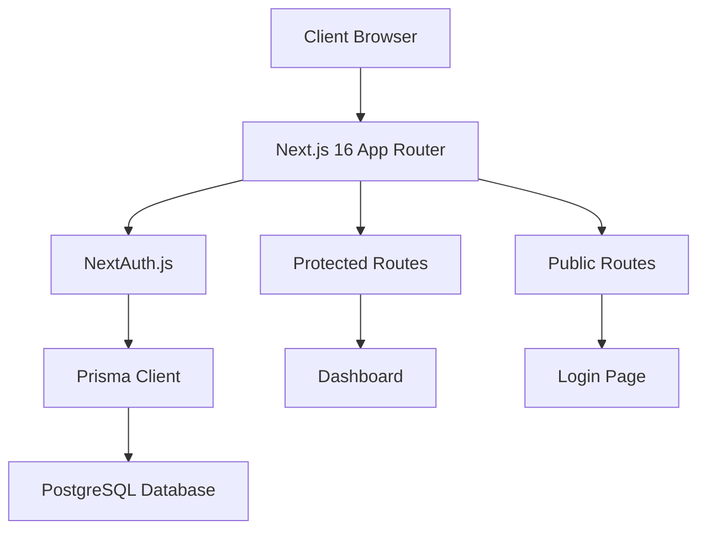

# Welcome to GAOTEV

GAOTEV is a production-ready management system built with modern web technologies. It provides a solid foundation for building secure, scalable web applications with user authentication, database management, and a clean architecture.

<Note>
  GAOTEV stands for **G**estion **A**uthentication **O**perations **T**racking **E**nterprise **V**ault - designed for enterprise-grade management solutions.
</Note>

## What is GAOTEV?

GAOTEV is a full-stack Next.js application that combines:

- **Modern Frontend**: Built with Next.js 16 and React 19
- **Secure Authentication**: Powered by NextAuth.js with credential-based login
- **Type-Safe Database**: Prisma ORM with PostgreSQL
- **Beautiful UI**: Tailwind CSS 4 with Lucide icons
- **Production Ready**: TypeScript, ESLint, and best practices

## Key Features

### Authentication & Security

GAOTEV implements robust authentication using NextAuth.js with bcrypt password hashing:

```typescript
import NextAuth from "next-auth"
import CredentialsProvider from "next-auth/providers/credentials"
import { PrismaClient } from "@prisma/client"
import bcrypt from "bcrypt"

const handler = NextAuth({
  providers: [
    CredentialsProvider({
      name: "Credentials",
      async authorize(credentials) {
        const user = await prisma.user.findUnique({
          where: { email: credentials.email },
        })
        
        if (!user) return null
        
        const isValid = await bcrypt.compare(
          credentials.password,
          user.password
        )
        
        return isValid ? { id: user.id, email: user.email } : null
      },
    }),
  ],
  session: { strategy: "jwt" },
})
```

<Tip>
  GAOTEV uses JWT sessions for stateless authentication, making it perfect for serverless deployments.
</Tip>

### Protected Routes

Route protection is implemented with Next.js middleware:

```typescript
// middleware.ts
export { default } from "next-auth/middleware"

export const config = {
  matcher: ["/dashboard"],
}
```

### Database Schema

Prisma provides type-safe database access with a clean schema:

```prisma
model User {
  id        String   @id @default(cuid())
  email     String   @unique
  password  String
  createdAt DateTime @default(now())
}
```

<Info>
  The User model uses CUID for IDs, providing better security and performance than traditional auto-increment integers.
</Info>

### Modern UI Components

The login interface showcases GAOTEV's polished design:

```jsx
import { Mail, Lock } from 'lucide-react'
import Image from 'next/image'

export default function Login() {
  const handleSubmit = async (e) => {
    e.preventDefault()
    const result = await signIn("credentials", {
      email,
      password,
      redirect: false,
    })
    
    if (result?.ok) {
      router.push("/dashboard")
    }
  }
  
  return (
    <div className="relative min-h-screen flex items-center justify-center">
      {/* Background image with blur effect */}
      <Image src="/images/login/Fondo.jpg" alt="Fondo login" fill />
      <div className="absolute inset-0 bg-black/40 backdrop-blur-sm" />
      
      {/* Login form with glassmorphism */}
      <form onSubmit={handleSubmit}>
        {/* Email and password inputs with icons */}
      </form>
    </div>
  )
}
```

## Architecture Overview

GAOTEV follows a modern, scalable architecture:



### Technology Stack

<CodeGroup>

```json package.json
{
  "dependencies": {
    "@prisma/client": "^6.19.2",
    "bcrypt": "^6.0.0",
    "lucide-react": "^0.563.0",
    "next": "16.1.6",
    "next-auth": "^4.24.13",
    "prisma": "^6.19.2",
    "react": "19.2.3",
    "react-dom": "19.2.3"
  }
}
```

```typescript tsconfig.json
{
  "compilerOptions": {
    "target": "ES2017",
    "lib": ["dom", "dom.iterable", "esnext"],
    "allowJs": true,
    "skipLibCheck": true,
    "strict": true,
    "noEmit": true,
    "esModuleInterop": true,
    "module": "esnext",
    "moduleResolution": "bundler",
    "resolveJsonModule": true,
    "isolatedModules": true,
    "jsx": "preserve",
    "incremental": true
  }
}
```

</CodeGroup>

### Core Components

| Component | Technology | Purpose |
|-----------|-----------|----------|
| **Frontend** | Next.js 16, React 19 | Server-side rendering, routing, API routes |
| **Authentication** | NextAuth.js 4.24 | Session management, credential validation |
| **Database** | Prisma 6.19 + PostgreSQL | Type-safe ORM, migrations, queries |
| **Styling** | Tailwind CSS 4 | Utility-first styling, responsive design |
| **Icons** | Lucide React | Modern, customizable icon library |
| **Security** | bcrypt 6.0 | Password hashing and validation |

## Use Cases

GAOTEV is ideal for:

<Steps>
  <Step title="Internal Management Systems">
    Build secure dashboards for employee, inventory, or project management
  </Step>
  
  <Step title="Client Portals">
    Create authenticated portals where clients can access their data and documents
  </Step>
  
  <Step title="SaaS Applications">
    Use as a foundation for multi-tenant SaaS products with user authentication
  </Step>
  
  <Step title="Admin Panels">
    Develop admin interfaces for content management or system configuration
  </Step>
</Steps>

## Benefits

### For Developers

- **Type Safety**: Full TypeScript support across frontend and backend
- **Developer Experience**: Hot reloading, auto-completion, and error checking
- **Modern Stack**: Latest versions of Next.js, React, and Prisma
- **Best Practices**: Clean architecture with separation of concerns

### For Production

- **Security First**: Bcrypt hashing, JWT sessions, and protected routes
- **Scalable**: Designed to grow from MVP to enterprise scale
- **Performance**: Server-side rendering and optimized bundle sizes
- **Maintainable**: Clear folder structure and documented code

<Warning>
  Always configure environment variables properly before deploying to production. Never commit `.env` files to version control.
</Warning>

## Project Structure

```
sistema-gestion/
├── app/
│   ├── api/
│   │   └── auth/
│   │       └── [...nextauth]/
│   │           └── route.ts          # NextAuth configuration
│   ├── dashboard/
│   │   └── page.jsx                  # Protected dashboard
│   ├── login/
│   │   └── page.jsx                  # Login page
│   ├── layout.tsx                    # Root layout
│   ├── providers.tsx                 # SessionProvider wrapper
│   └── page.tsx                      # Home (redirects to login)
├── prisma/
│   └── schema.prisma                 # Database schema
├── public/
│   └── images/                       # Static assets
├── middleware.ts                     # Route protection
└── package.json                      # Dependencies
```

## Next Steps

Ready to get started? Follow our [Quickstart Guide](/quickstart) to set up GAOTEV on your local machine in minutes.

<CardGroup cols={2}>
  <Card title="Quickstart" icon="rocket" href="/quickstart">
    Get GAOTEV running locally in under 5 minutes
  </Card>
  
  <Card title="Authentication" icon="shield" href="/features/authentication">
    Learn how authentication works in GAOTEV
  </Card>
  
  <Card title="Database" icon="database" href="/features/database">
    Understand the Prisma schema and migrations
  </Card>
  
  <Card title="Deployment" icon="cloud" href="/development/deployment">
    Deploy GAOTEV to production environments
  </Card>
</CardGroup>